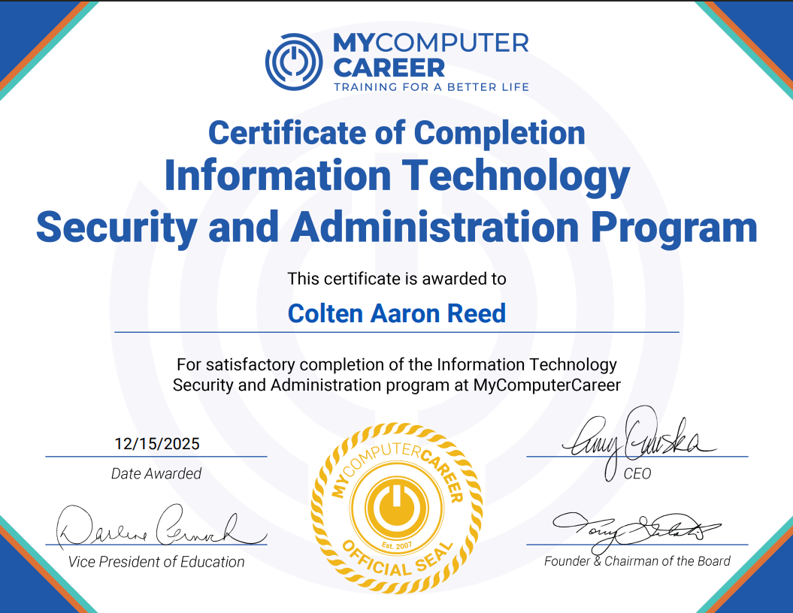
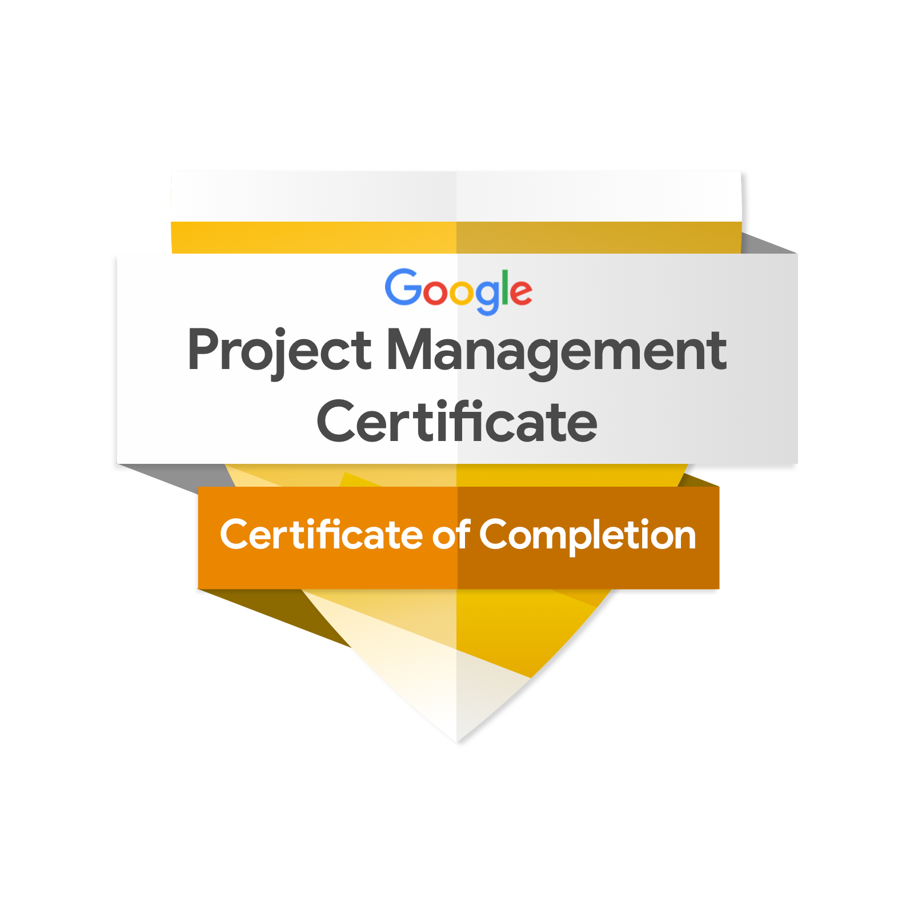

# 🎓 Professional Certifications Portfolio 🎓

 

---

## **Colten A. Reed** 
## IT Specialist | Cloud Administrator | Cloud & Security Architect

This repository hosts my professional certification portfolio with clickable badges that link directly to official verification pages.

---

## 📜 Certifications

### 🎓 Harvard University

**CS50: Computer Science**
[View Certificate →](https://github.com/careed23/Certification/blob/main/CS50-Certificate.pdf)

---

### 🎓 MyComputerCareer

**MyComputerCareer IT Specialist Diploma & Professional Accolade**
*Information Technology training and credentialing from MyComputerCareer*

[View Diploma →](https://github.com/careed23/certifications/blob/main/itsa.pdf)

---

**Google Project Management Professional Certificate**
*Foundations of Project Management, Project Initiation, Planning, and Execution*

**Credential ID:** `4LM72C4JTGZJ`  
**Issued:** 2026

[Verify via Coursera →](https://coursera.org/verify/4LM72C4JTGZJ)

---

### 🔧 CompTIA

 

**Verification Codes:**
`A+: 68aee1916dc4431a868a4d495470b667`
`Network+: 48838672f4d945f9ad1abd618fae37d1`
`Security+: 8d5686fba80b45a9ab2db7966bba8d1b`
`CSIS/CIOS: COMP001022773409`

[Verify at CompTIA.org →](http://verify.CompTIA.org)

---

### ☁️ Microsoft Azure

**Microsoft Azure Fundamentals (AZ-900)** | **Microsoft Azure AI Fundamentals (AI-900)**
[Verify AZ-900 →](https://learn.microsoft.com/en-us/users/coltenreed-3632/credentials/a1dcb2ddadd4594f) | [Verify AI-900 →](https://learn.microsoft.com/en-us/users/coltenreed-3632/credentials/32e37594ad73ece0)

---

### 🗄️ Oracle

**Oracle Cloud Infrastructure Foundations Associate 2025**
*Cloud Infrastructure Fundamentals*
**Issued:** 2025

---

### 🐧 Linux Professional Institute

**Linux Essentials**
**Verification Code:** `6e0f27ba-4c99-4cc3-b805-4d9e071118fc`
[Verify at LPI.org →](https://cs.lpi.org/caf/Xamman/certification)

---

## 🛠️ Technical Expertise

**Cloud & Virtualization:** Microsoft Azure, AWS, Oracle Cloud Infrastructure (OCI), Infrastructure as Code (Terraform)
**Security & Compliance:** Network Security, Firewall Management, IAM, MFA
**Operating Systems:** Windows Server, Ubuntu/Linux, macOS
**Infrastructure:** Active Directory, System Administration, Network Administration
**Automation & Scripting:** Python, YAML, Jinja2, GitOps, Agile Methodology

---

## 🔗 Links

**GitHub:** [github.com/careed23](https://github.com/careed23)
**LinkedIn:** [linkedin.com/in/colten-reed-8395b6389](https://www.linkedin.com/in/colten-reed-8395b6389)
**Email:** tat2creed@gmail.com

---

## 📄 License

This portfolio is for professional verification purposes. All certification badges and trademarks are property of their respective organizations.

---

**⭐ Star this repository if you find it helpful!**

Made with 🧠 by Creed

